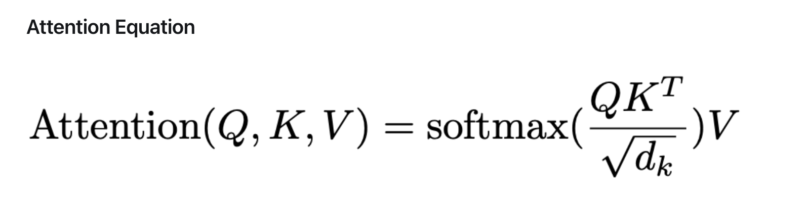

<!-- # Project-CUDA-FlashAttention
UPenn CIS5650 Final Project

# Milestone 1 Presentation (11.15)
[Slides](https://docs.google.com/presentation/d/1lzf_PbofKWlHH4tNWwzR7XEY06Li9M6MPq8gfuu-Q-k/edit?usp=sharing) -->

# Efficient Large Language Model (LLM) Decoding 

## Introduction
Large Language Models (LLMs), central to contemporary natural language processing, face challenges in text generation efficiency due to their substantial computational requirements. This project aims to advance LLM inference efficiency by minimizing computational load and optimizing GPU performance.

---

## Project Objective
Our goal is to investigate and integrate advanced acceleration methods for LLM decoding. We plan to evaluate these methods using GPU benchmarks, drawing insights from several key papers:

1. **[FlashAttention: Fast and Memory-Efficient Exact Attention with IO-Awareness](https://arxiv.org/pdf/2205.14135.pdf)**
2. **[FlashAttention-2: Faster Attention with Enhanced Parallelism and Work Partitioning](https://arxiv.org/pdf/2307.08691.pdf)**
3. **[FLASHDECODING++: Accelerated Large Language Model Inference on GPUs](https://arxiv.org/pdf/2311.01282.pdf)**
4. **[PagedAttention: Optimized Memory Management in LLM Serving with PagedAttention](https://arxiv.org/pdf/2309.06180.pdf)**

Our ultimate goal is to synthesize the best features from these studies to create an innovative, more efficient decoding algorithm.

---

## Traditional LLM Decoding Algorithm
The conventional LLM decoding algorithm depends significantly on the self-attention mechanism, which, while effective, is a primary source of computational inefficiency in LLMs.

### Attention Mechanism

The attention mechanism is crucial in neural networks, especially for natural language processing. It dynamically concentrates on certain parts of the input sequence to produce each part of the output, similar to selective human attention.

Here's a basic formula for self-attention calculation:

    
where `Q`, `K`, and `V` are query, key, and value matrices, respectively. The attention score is calculated by multiplying the query and key matrices, and the weighted sum is calculated by multiplying the attention score and the value matrix.

---

### Computational Intensity and Equations
From the equation, we can obersereve that the computational intensity of the attention mechanism stems mainly from calculating attention scores and generating weighted sums, which involve complex matrix operations in LLMs. However, we've chosen not to prioritize direct optimization of these operations because:

- They are fundamental to the model's functionality and accuracy.
- Alterations could potentially compromise the quality of the model's output.

---

### IO-Bound Nature of Attention
Attention efficiency is often restricted by IO operations, particularly in large-scale models, due to:

* **High Memory Bandwidth Usage**: Extensive data access is required for attention calculations.
* **Sequential Data Access**: Operations like matrix multiplication can't fully utilize modern hardware's parallel processing.
* **Data Transfer Overheads**: Significant overheads occur when transferring large datasets in distributed or GPU-based systems.
Enhancing IO efficiency is crucial for improving LLM performance.

---

### KV Cache as an Optimization Vector
An additional direction for optimization is the Key-Value (KV) cache. Optimizing the KV cache can lead to:

* **Reduced Redundancy**: By efficiently caching and reusing key and value pairs, the need for recalculating these elements for each decoding step is minimized.
* **Enhanced Speed**: Streamlining the access and retrieval process from the KV cache can significantly speed up the decoding process.
* **Lower Memory Footprint**: Efficient caching reduces the memory requirements, which is particularly beneficial for models operating on limited-resource environments or aiming for real-time applications.

---

So, in this project, we mainly focus on the optimization fo the IO-bound nature of attention and the KV cache, which is discuessed the FlashAttention and PagedAttention papers respectively.

# FlashAttention Algorithm
## FlashAttention-1
FlashAttention-1 introduces an IO-aware optimization to the attention mechanism. It significantly reduces memory usage and enhances processing speed by optimizing data flow between memory and processing units.

## FlashAttention-2
Building upon FlashAttention-1, this version further improves parallel processing and workload partitioning. It aims to maximize GPU utilization and reduce latency in LLM decoding.

## FlashDecoding
FlashDecoding focuses on optimizing the entire LLM decoding pipeline for GPUs. It restructures traditional decoding algorithms to better suit the parallel nature of GPU architectures.

## FlashDecoding++
FlashDecoding++ is an advanced version that further refines GPU utilization strategies. It introduces novel techniques for managing large-scale language model inference, thereby boosting decoding speeds significantly.

# PagedAttention Algorithm
The PagedAttention algorithm addresses memory management in large LLMs. It introduces a paged memory system, allowing for efficient handling of large models without compromising on speed or accuracy.

---
