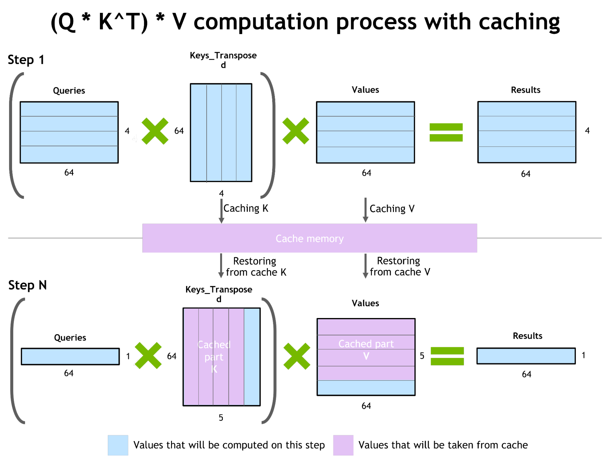

# Efficient Large Language Model (LLM) Inferencing on GPUs

The LLM Inference Engine is deployed at [llm.toytag.net](https://llm.toytag.net). It consists of math and engineering tricks that make efficient hosting possible, and make the model aware of the latest info about this course (even this particular project). Feel free to try it out!

The inference service runs on a single NVIDIA L4 Tensor Core GPU with 24 GiB VRAM that consumes less than 75W of power. The large language model is [Intel's Neural Chat](https://huggingface.co/Intel/neural-chat-7b-v3-1) model finetuned from [Mistral-7B](https://huggingface.co/mistralai/Mistral-7B-v0.1) base model with 7 billion parameters, which is also a GPT style language model. The service takes more than 20 GiB of VRAM, and ~7 billion is about the largest model we could run without any precision loss on this GPU.

This repo contains our implementation of Flash Attention and its variants. The LLM inference service code is a fork from vLLM project with our **custom kernel**, **frontend**, and **docker build & compose rules** for hassle-free deployment. The service project is presented as a git submodule in the current repo, or you could directly visit [this link](https://github.com/toytag/vllm/tree/8e41936777ea375e4cd4f463249f0870bbb5f06a).

## Introduction
Large language models (LLMs) like ChatGPT or Llama have recently gained a lot of attention. However, operating them is still quite costly. The expense of generating a single response, which might be around $0.01 for a brief interaction using an 8xA100 instance on AWS at the moment, can become substantial when considering billions of users engaging in multiple interactions daily. Certain tasks, such as code auto-completion which activates with each new character typed, are particularly resource-intensive. As LLMs are increasingly employed in various applications, even minor improvements in generation efficiency can lead to significant overall cost reductions.

<!-- The process of LLM inference, or "decoding", is sequential, with tokens being produced **one at a time**. To generate complete sentences of `N` tokens, the model must go through `N` iterations. The good news is that it's possible to store previously computed tokens, meaning that each step of generation isn't influenced by the total length of the context. The exception is the attention mechanism, which doesn’t scale as efficiently with the length of the context. -->

## Project Objective

Our goal is to investigate and integrate advanced acceleration methods for LLM inference. We plan to evaluate these methods using GPU benchmarks, drawing insights from several key papers and blogs:

1. **[FlashAttention: Fast and Memory-Efficient Exact Attention with IO-Awareness](https://arxiv.org/pdf/2205.14135.pdf)**
2. **[FlashAttention-2: Faster Attention with Enhanced Parallelism and Work Partitioning](https://arxiv.org/pdf/2307.08691.pdf)**
3. **[PagedAttention: Optimized Memory Management in LLM Serving with PagedAttention](https://arxiv.org/pdf/2309.06180.pdf)**
4. **[Flash-Decoding for long-context inference](https://crfm.stanford.edu/2023/10/12/flashdecoding.html)**
5. **[FlashDecoding++: Accelerated Large Language Model Inference on GPUs](https://arxiv.org/pdf/2311.01282.pdf)**

Our ultimate goal is to synthesize the best features from these studies to create an innovative, more efficient inference algorithm.

## LLM Inference Pipeline

The conventional LLM decoding algorithm heavily relies on the attention mechanism. While this mechanism is pivotal for the model's effectiveness, it also represents a significant source of computational inefficiency in LLMs. The overall LLM inference pipeline is illustrated as follows:

The inference pipeline can be segmented into three primary phases:

1. **Prefill**: In this phase, the attention mechanism generates the initial token and establishes the Key-Value (KV) cache based on the user's input query. This phase predominantly involves the General Matrix Multiply (GEMM) operation.

2. **KV Cache**: The KV cache plays a critical role in storing the key and value matrices. These matrices are crucial as they help in minimizing redundant computations during the decode phase.

3. **Decode**: This phase, involving another attention mechanism, is responsible for generating subsequent tokens and updating the KV cache in accordance with the user's input query. The primary operations here include the General Matrix-Vector (GEMV) and Flattened GEMM.

To optimize the LLM inference pipeline, it's essential to focus on enhancing each of these three components. This begins with a deeper understanding of the attention mechanism and the intricacies of the KV cache.

---

### Attention Mechanism in LLM Inference

Following the outline of the LLM inference pipeline, a key component that necessitates optimization is the attention mechanism. Predominant in neural networks, especially for NLP tasks, the attention mechanism is akin to human selective attention. It selectively concentrates on specific segments of the input sequence to craft each part of the output. This dynamic focus is crucial for efficiently processing and contextualizing long sequences.

The self-attention mechanism within LLMs is governed by the following formula:

In this equation:
- `Q` denotes the Query matrix.
- `K` represents the Key matrix.
- `V` is the Value matrix.

The attention mechanism unfolds in two primary steps:
1. **Attention Score Calculation**: First, the attention scores are determined by multiplying the Query (`Q`) with the Key (`K`) matrices. These scores quantify how much focus should be allocated to various parts of the input sequence.
2. **Weighted Sum Generation**: Subsequently, these attention scores are used to compute a weighted sum by multiplying them with the Value (`V`) matrix. This produces the output, a refined synthesis of the input, adjusted according to the attention scores.

This mechanism is integral to the 'Prefill' and 'Decode' phases of the LLM inference pipeline. Enhancing its efficiency is crucial, as it directly impacts the model's computational demands and the quality of the generated output.

---

### KV Cache

The Key-Value (KV) Cache is also an integral component of the LLM inference pipeline, particularly within the context of the attention mechanism. The KV cache serves as a storage mechanism for the Key (`K`) and Value (`V`) matrices, which are central to the attention mechanism's computations.

As the image shows, once the K and V matrices are computed, they are stored in the cache memory for future use to avoid redundant computations. The cache is updated with each new token generated, and the updated matrices are used to generate the next token. This process continues until the entire sequence is generated.

The efficiency of the KV cache directly influences the performance of the LLM. Optimizing its storage and retrieval processes can lead to faster and more resource-efficient model inference.

---

With a comprehensive understanding of the attention mechanism and the KV cache, we are now equipped to explore the optimization strategies for each step in the LLM inference pipeline. This exploration will focus on enhancing the efficiency and speed of the entire decoding process, from the initial prefill to the final token generation.

## Prefill Optimization

### [FlashAttention-1](https://arxiv.org/pdf/2205.14135.pdf)

Prior to the development of FlashAttention, numerous attempts were made to accelerate the attention process by reducing the Floating Point Operations Per Second (FLOPs). However, these methods fell short in efficiently managing the demands of large-scale LLM inference. Recognizing this gap, the authors of FlashAttention introduced a crucial principle: making attention algorithms Input/Output (IO) aware. This approach involves meticulously balancing data reads and writes between various levels of memory, such as the fast on-chip GPU Static Random Access Memory (SRAM) and the relatively slower GPU High Bandwidth Memory (HBM).

In the era of modern GPUs, where computational speed often surpasses memory speed, most attention operations are hindered by memory access bottlenecks. Traditional attention mechanisms typically involve eight read-write operations to the HBM.

The figure above shows that SRAM has far higher read-write speeds compared to HBM, albeit with significantly less storage capacity. To optimize this, FlashAttention introduces a method to reduce read-write operations to HBM. It segments matrices involved in computations into smaller blocks for processing in SRAM, thereby increasing read-write efficiency and reducing dependency on HBM.

Below is a diagram illustrating the FlashAttention algorithm, emphasizing its innovative strategies like tiling and softmax rescaling.

Furthermore, FlashAttention utilizes a fused kernel approach to minimize memory access and further refine the attention process.

For comprehensive details on the FlashAttention algorithm, refer to the [original paper](https://arxiv.org/pdf/2205.14135.pdf) and the insightful [blog post](https://gordicaleksa.medium.com/eli5-flash-attention-5c44017022ad) by Aleksa Gordić, which offers an in-depth explanation of these concepts.

---

### [FlashAttention-2](https://arxiv.org/pdf/2307.08691.pdf)

FlashAttention-2 builds on the foundation laid by FlashAttention-1, introducing key enhancements to boost performance further. These improvements focus on optimizing computational efficiency and parallel processing capabilities on GPUs.

* **Reduction in Non-Matmul FLOPs**: The updated algorithm minimizes non-matrix multiplication (non-matmul) Floating Point Operations Per Second (FLOPs). This is crucial because modern GPUs, like Nvidia's with Tensor Cores, are highly efficient at matrix multiplication operations. For instance, the A100 GPU can theoretically perform 312 TFLOPs/s of FP16/BF16 matmul, but only 19.5 TFLOPs/s of non-matmul FP32 operations. Essentially, each non-matmul FLOP is about 16 times more costly than a matmul FLOP. By focusing more on matmul FLOPs, FlashAttention-2 ensures higher throughput.

* **Enhanced Parallelism**: The original FlashAttention algorithm parallelizes computations over batch size and the number of heads, utilizing one thread block per attention head. This approach is efficient when the total number of thread blocks (batch_size * number of heads) is large, allowing optimal use of the GPU's compute resources. However, for longer sequences, which often correspond to smaller batch sizes or fewer heads, the new version introduces additional parallelization over the sequence length dimension. This change significantly improves performance in scenarios with long sequences.

* **Improved Work Partitioning**: FlashAttention-2 also refines the work partitioning within each thread block, distributed among different warps (groups of 32 threads). The original version typically employs 4 or 8 warps per thread block. The revised partitioning in FlashAttention-2 reduces the need for synchronization and communication between warps, leading to fewer shared memory reads/writes and enhanced overall efficiency.

The figure below compares FlashAttention-1 and FlashAttention-2, illustrating the enhancements in parallelism and work partitioning:

The blog written by the Tri Dao (author of FlashAttention-2) offers a detailed explanation of the algorithm and its enhancements. For more information, refer to the [original paper](https://arxiv.org/pdf/2307.08691.pdf) and the [blog post](https://crfm.stanford.edu/2023/07/17/flash2.html).

## KV Cache Optimization

### [PagedAttention](https://arxiv.org/pdf/2309.06180.pdf)

PagedAttention represents a breakthrough in attention algorithms, taking inspiration from virtual memory and paging techniques used in operating systems. This novel approach redefines the management of the Key-Value (KV) cache in large language models.

Traditionally, the KV cache is managed in contiguous memory spaces, as shown in the figure below. However, PagedAttention diverges from this norm by dividing the KV cache into discrete blocks. Each block holds attention keys and values for a certain number of tokens, but unlike conventional methods, these blocks are not stored in contiguous spaces.

This departure from contiguous space caching significantly reduces both internal and external fragmentation in GPU memory. The PagedAttention approach mirrors the flexibility of an operating system's virtual memory management, leading to more effective memory utilization. As a result, models can handle larger batch sizes, translating to higher throughput in LLM inference tasks, particularly for those involving lengthy sequences.

Below is a diagram illustrating the PagedAttention algorithm. This visual representation highlights the algorithm's unique approach to memory management, fundamentally enhancing the efficiency of large language model inferencing.

The implementation of PagedAttention marks a significant stride in optimizing the KV cache, promising to bolster the scalability and efficiency of large-scale language model inference.

## Decode Optimization

### [FlashDecoding](https://crfm.stanford.edu/2023/10/12/flashdecoding.html)

In the decoding phase of LLM inference, each newly generated token must attend to all preceding tokens. This necessitates the computation of `softmax(queries @ keys.transpose) @ values`, a process that introduces unique optimization challenges.

While FlashAttention versions 1 and 2 optimize this operation in the prefill phase, primarily addressing memory bandwidth bottlenecks (e.g., Q @ K^T), these optimizations aren't directly applicable to the decode phase. The bottlenecks during decoding are distinct. FlashAttention typically parallelizes across batch size and query length dimensions. However, in decoding, the query length is usually 1. This means that if the batch size is less than the number of Streaming Multiprocessors (SMs) on the GPU (108 on an A100, for example), the GPU is underutilized. This scenario is common with long contexts, which necessitate smaller batch sizes to fit within GPU memory limits. With a batch size of 1, FlashAttention could utilize less than 1% of the GPU's capacity!

Flash-Decoding, an extension of FlashAttention, introduces a novel parallelization dimension: the keys/values sequence length. It effectively combines the advantages of both FlashAttention versions. Like its predecessors, Flash-Decoding minimizes extra data storage in global memory. Crucially, it maximizes GPU utilization even with small batch sizes, provided the context length is substantial.

Below are visual comparisons highlighting the differences between Flash Attention and Flash Decoding:

#### Flash Attention

#### Flash Decoding

In addition, Flash-Decoding achieves parallelization across keys and values, albeit at the cost of a minor final reduction step.

Flash-Decoding operates in three primary steps:

1. **Splitting Keys/Values**: The keys and values are divided into smaller chunks.
2. **Parallel Attention Computation**: The attention of the query with each split is computed in parallel using FlashAttention. This step also involves writing an additional scalar per row and split: the log-sum-exp of the attention values.
3. **Final Output Calculation**: The actual output is derived by reducing over all splits, using the log-sum-exp values to scale the contribution of each split.

This approach leverages the iterative nature of attention/softmax calculations. Flash-Decoding applies this principle at two levels: within each split (akin to FlashAttention) and across splits for the final reduction.

In practice, step (1) involves no GPU operations, as the key/value chunks are simply views of the full tensors. The process then uses two separate kernels to execute steps (2) and (3) respectively.

---

### [FlashDecoding++](https://arxiv.org/pdf/2311.01282.pdf)

While Flash-Decoding significantly improved GPU utilization, there was still room for optimization, particularly in the computation of softmax values. In the original Flash-Decoding algorithm, the softmax calculation requires subtracting the maximum attention score value from each score. Given the parallelization across the key/value sequence length, this maximum value varies for each split. Consequently, it necessitates storing the maximum value for each split and using synchronization to compute the global maximum across all splits. According to the paper, this partial softmax operation introduces approximately 20% overhead in the attention process.

FlashDecoding++ addresses this challenge by implementing a unified maximum value approach for softmax computations, effectively eliminating the need for synchronization.

#### Comparison of Softmax Implementations
The figure below illustrates the differences between various softmax implementations:

- Traditional attention uses the standard softmax method.
- FlashDecoding employs partial softmax, requiring synchronization among different partial vectors.
- FlashDecoding++ adopts partial softmax with unified max values, thus removing the synchronization requirement.

#### Distribution of elements in the input vectors of softmax in LLMs
The statistical distribution of elements in the input vectors of softmax varies across different large language models. The following figure displays this distribution for various LLMs:

However, as shown, the distribution of elements differs among LLMs. This variability implies the necessity for manual tuning of the maximum value for each specific LLM. For models like OPT-6.7B, which exhibit a broad distribution, the unified max value might not be optimally effective. Thus, while FlashDecoding++ streamlines the softmax calculation, it also introduces considerations for model-specific adjustments.

## Performance Evaluation

### LLM Inference Service: First Token Latency

Here we are testing the latency of the first token/word generation during LLM serving. The latency is measured (in milliseoncds) from the time when the user send the generation request to the time when the first token is generated and send back to the user. The red bar is a similar-sized network package send to the service to measure the underlying network latency. The yellow bar is when the when we disable caching, and we are using the simple attention kernel. The blue bar is when we switch to the flash decoding kernel. And finally the green bar is when we enable caching. This cache is very similar to the "first bounce cache" in project3 when we implement the path tracer by reusing the previous intermediate results. Whether it is paged or not doesn't matter here.

The network latency is negligible compared to the generation time. As the model size increases, the effect of caching decreases and the acceleration from flash decoding starts to shine. When the model size becomes too large, memory becomes the bottleneck so cache doesn't help much. However, flash decoding can decrease the memory access when calculating softmax, results in more siginificant speedup.

### LLM Inference Service: Throughput

### Perplexity

### Memory Usage

## References

- **Accelerated Inference for Large Transformer Models Using NVIDIA Triton Inference Server**: [NVIDIA Developer Blog](https://developer.nvidia.com/blog/accelerated-inference-for-large-transformer-models-using-nvidia-fastertransformer-and-nvidia-triton-inference-server/)
- **FlashAttention Github**: [Github Repository](https://github.com/Dao-AILab/flash-attention)
- **FlashAttention-2 Blog**: [Stanford CRFM Blog](https://crfm.stanford.edu/2023/07/17/flash2.html)
- **Flash Attention Inference Github**: [Github Repository](https://github.com/Bruce-Lee-LY/flash_attention_inference)
- **vLLM Github**: [Github Repository](https://github.com/vllm-project/vllm)

[Back to top](#efficient-large-language-model-llm-inferencing-on-gpus)
